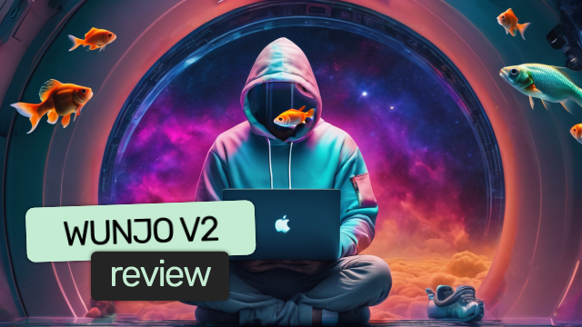

[](https://github.com/wladradchenko/wunjo.wladradchenko.ru/blob/main/LICENSE)
[](https://www.python.org/downloads/release/python-310/)
[](https://github.com/wladradchenko/wunjo.wladradchenko.ru)
[](https://github.com/wladradchenko/wunjo.wladradchenko.ru/blob/main/LICENSE)
[](https://dev.to/wladradchenko/series/24089)
[](https://youtube.com/playlist?list=PLJG0sD6007zFJyV78mkU-KW2UxbirgTGr&feature=shared)
[](https://huggingface.co/wladradchenko/wunjo.wladradchenko.ru)

<p align="right">[<a href="README_ru.md">RU v2.0</a>]</p>
<div id="top"></div>

<br />
<div align="center">
  <a href="https://github.com/wladradchenko/wunjo.wladradchenko.ru">
    
  </a>

  <h3 align="center">Wunjo Community Edition (CE)</h3>

  <p align="center">
    <a href="https://github.com/wladradchenko/wunjo.wladradchenko.ru/wiki">Documentation</a>
    <br/>
    <a href="https://github.com/wladradchenko/wunjo.wladradchenko.ru/issues">Issue</a>
    ·
    <a href="https://github.com/wladradchenko/wunjo.wladradchenko.ru/discussions">Discussions</a>
    ·
    <a href="https://youtube.com/playlist?list=PLJG0sD6007zFJyV78mkU-KW2UxbirgTGr&feature=shared">Tutorial</a>
  </p>
</div>

<!-- WUNJO V2 -->
## Big update Wunjo v2.0.3

### Video generation here!

<b>Hey there!</b> Your support means the world to me and is crucial in accelerating the release of new updates for the Community Edition (CE). Your encouragement and stars drives me to enhance features. And now <b>video generation</b> from text or image in CE with difference aspect ratio before 4 seconds with 24 FPS (or more duration with low FPS).

Also text to image, inpaint and outpaint image for video generation. <b>Control restyling?</b> Now you can change objects, gender and nationality of a person not just in one click, but also control the process in advance. And you only need 8 GB VRAM for this. (You can use any Stable Diffusion model v1.5, see GitHub Wiki)

### Available now

<b>Professional (Pro) version</b> available on <a href="https://wunjo.online">wunjo.online</a> to download. <b>Community Edition (CE)</b> available on GitHub with voting for features to migrate on <a href="https://boosty.to/wunjo">Boosty</a>.

<b>And if you wanna help to project, you can do:</b> 
<ul>
  <li>Spread the Word: Share the project with your friends and invite them to join our community.</li>
  <li>Stay Connected: Subscribe to the Wunjo project on GitHub and follow me on social media. You can find me by <a href="https://www.youtube.com/@wladradchenko">wladradchenko</a> in social media and <a href="https://t.me/wladblog">wladblog</a> in Telegram.</li>
  <li><a href="https://boosty.to/wunjo">Support on Boosty</a>: Your support on Boosty will help determine which features from the Professional version will migrate to the CE.</li>
</ul>

<details>
<summary>What is update? Open this list to see full review on YouTube.</summary>
  
<div align="center">
  <table>
  <tr>
    <th>Review</th>
  </tr>
  <tr align="center">
    <td><a href="https://youtu.be/-MGow5zCZUQ?si=msVDNhIPruBtg9ah"></a></td>
  </tr>
</table>
</div>

</details>

<!-- ABOUT THE PROJECT -->
## About

Wunjo harnesses the power of neural networks to provide cutting-edge solutions in speech synthesis, voice cloning, content restyling, and deepfake animations. Official website <a href="https://wunjo.online">wunjo.online</a>.

<div align="center">
  <table>
  <tr>
    <th>Try it now</th>
  </tr>
  <tr align="center">
    <td><a href="https://wunjo.online/static/login/title.mp4"></a></td>
  </tr>
</table>
</div>

<details>
<summary><b>Open list to see more details.</b></summary>

The new version 2.0 introduces a completely redesigned interface, enhanced performance, improved face swap functionality, a generator for non-existent people’s faces, and a deepfake analyzer. It also includes improvements in lip sync, content enhancement, object, text, and background removal, as well as content and component restyling using text prompts. Additionally, public links enable community creation and collaboration.
For audio you will able to use improved audio separator and <b>clone voice on any language from text and audio</b>.

Available as both a free Community Edition and a subscription-based Professional Edition on <a href="https://wunjo.online/pricing">wunjo.online</a>, Wunjo caters to a wide range of users, from beginners to professionals, ensuring privacy by operating locally on your device.

**Why Choose Wunjo Community Edition?**

- **All-in-One:** A comprehensive tool catering to both your voice and visual AI needs.
- **User-friendly:** Designed for all, from beginners to professionals.
- **Privacy First:** Functions locally on your desktop, ensuring your data remains private.
- **Open-source & Free:** Benefit from community-driven enhancements and enjoy the app without any cost.

**Why Choose Wunjo Professional?**

- **More features:** First access to updates, additional and more advanced features ad restyling and clone voice.
- **Public links:** Host your own server (PC) application accessible from anywhere in the world.
- **Unlimited performance:** Process multiple tasks simultaneously to increase overall productivity.

Step into the future of AI-powered creativity with Wunjo.
</details>

<!-- FEATURES -->
## Setup

Requirements [Python](https://www.python.org/downloads/) version 3.10 and [ffmpeg](https://ffmpeg.org/download.html). For GPU it is necessary to install CUDA on Nvidia processors.

For detailed instructions about setup Wunjo CE from GitHub, refer to the [Launch Project from GitHub](https://github.com/wladradchenko/wunjo.wladradchenko.ru/wiki/How-to-install-the-application#launch-project-from-github) section in our wiki.

<div align="center">
  <table>
  <tr>
    <th>How build from code on Windows?</th>
  </tr>
  <tr align="center">
    <td><a href="https://youtu.be/fucxKhX7n4E"></a></td>
  </tr>
</table>
</div>

<!-- DOWNLOAD -->
You will find on [wunjo.online](https://wunjo.online) official installers on Wundows/Ubuntu.

<details>
<summary><b>⚠️ Run GPU on AMD ⚠️</b></summary>

You can use the GPU processor on AMD too, if you managed to install [ZLUDA](https://github.com/vosen/ZLUDA). 

```
python -m pip install -r requirements_zluda.txt
python -m pip install -U torch torchaudio torchvision --extra-index-url https://download.pytorch.org/whl/rocm6.1
python -m pip install -U xformers --extra-index-url https://download.pytorch.org/whl/rocm6.1
cd portable
briefcase dev
```

More details in [Issue 65](https://github.com/wladradchenko/wunjo.wladradchenko.ru/issues/65) and its continuation [Issue 68](https://github.com/wladradchenko/wunjo.wladradchenko.ru/issues/68).

</details>

<!-- UPDATE -->

## Updates

<details>
<summary>Update 2.0.0</summary>

- [x] Completely redesigned interface for desktop and mobile devices, from ground zero.
- [x] Enhanced performance with simultaneous task handling, stability, and faster processing.
- [x] Improved face swap functionality now supports multiple face swap at different timings via API.
- [x] Introducing generator of non-existent people face.
- [x] Deepfake analyzer added to discern authentic content from manipulated media.
- [x] Enhanced lip sync for smoother animations and elimination of chin defects.
- [x] Real-time mask selection for seamless editing experience.
- [x] Added select area to remove text.
- [x] Separated tasks for object removal and background elimination for greater precision. Now you can create chroma key video.
- [x] Custom file manager introduced for efficient file management within the application.
- [x] Improved interaction with neural network models, including seamless downloading from the internet.
- [x] Easy switch from client to server application and back.
- [x] Multi-user support with customizable limits on simultaneous tasks and memory usage (RAM, VRAM, duration, size, number at the same time task).
- [x] Internal tips provided for optimizing content quality.
- [x] Smart generator of prompts for video and object restyling.

</details>

<details>
<summary>Update 2.0.1</summary>

- [x] Fix bugs.

</details>

<details>
<summary>Update 2.0.2</summary>

- [x] Added functionality to clone voice in any language from text and audio.
- [x] Improved audio separator to remove noise before clone voice.
- [x] Enhanced processing speed.

</details>

<details>
<summary>Update 2.0.3</summary>

- [x] Added control restyling (This work with 8 GB VRAM).
- [x] Added generation text-to-video, image-to-video, text-to-image, outpaint and inpaint image.
- [x] Improved quality of restyling.

</details>

<details>
<summary>List features updates</summary>

- [ ] Public link exchange for online users.
- [ ] Multi language interface.
- [ ] Improve user profile.
- [ ] Improve processing content status.
- [ ] Sound generation for video or from text.
</details>

<!-- DONAT -->
## Support the Project

You can support the author of the project in the development of his creative ideas on <a href="https://boosty.to/wunjo">Boosty</a> or <a href="https://wladradchenko.ru/donat">CloudTips</a>. Thanks to Boosty, you will have the opportunity to use your voice to choose which functions from the Professional version will appear in the Community Edition in new updates. There are other ways to support the development of the project, more details on [page](https://github.com/wladradchenko/wunjo.wladradchenko.ru/wiki/Support-the-Project).

<div align="center">
  <table>
  <tr>
    <th>Boosty</th>
    <th>CloudTips</th>
  </tr>
  <tr align="center">
    <td></td>
    <td></td>
  </tr>
</table>
</div>

### Supporters and Donors

I extend heartfelt gratitude to the following individuals who have generously supported this project through donations:

- **[Monogo](https://github.com/monogo)** - 110$.
- **S.** - 50$.
- **[Konstantin Kravtsov](https://t.me/kostiang)** - 35$.
- **LEO** - 5$.
- Several contributors who have chosen to remain anonymous or opted not to be listed publicly. Your support is immensely appreciated.

I sincerely appreciate the generosity of all project supporters. Your contributions enable me to continue improving and maintaining this project.

<!-- CONTACT -->
## Contact

Owner: [Wladislav Radchenko](https://github.com/wladradchenko/)

Email: [i@wladradchenko.ru](i@wladradchenko.ru)

Project: [https://github.com/wladradchenko/wunjo.wladradchenko.ru](https://github.com/wladradchenko/wunjo.wladradchenko.ru)

Web site: [wunjo.online](https://wunjo.online)

<!-- PREMISE -->
## Premise

Wunjo comes from the ancient runic alphabet and represents joy and contentment, which could tie into the idea of using the application to create engaging and expressive speech. Vunyo (ᚹ) is the eighth rune of the Elder and Anglo-Saxon Futhark. Prior to the introduction of the letter W into the Latin alphabet, the letter Ƿynn (Ƿƿ) was used instead in English, derived from this rune.

<!-- CREDITS -->
## Credits

Wunjo is built upon the remarkable work of various open-source projects. Each integrated component reflects a commitment to improving and adapting existing technologies within the collaborative landscape of open-source development. The list below highlights the projects that have been adapted and enhanced for inclusion in Wunjo:

- **User Interface & Packaging:** Implementations of [Flask UI](https://github.com/ClimenteA/flaskwebgui) and [BeeWare](https://beeware.org/project/projects/tools/briefcase/)
- **Facial Animation & Enhancement:** Adapted versions of [Wav2lip](https://github.com/Rudrabha/Wav2Lip), [Face Utils](https://github.com/xinntao/facexlib), [Insightface](https://github.com/deepinsight/insightface) which provided a well-made library and some models for face.
- **Image & Video Enhancement:** Adapted [Real-ESRGAN](https://github.com/xinntao/Real-ESRGAN) for superior quality enhancements
- **Video Processing & Segmentation:** Adaptations of [Segment Anything](https://github.com/facebookresearch/segment-anything), [Rerender a Video](https://github.com/williamyang1991/Rerender_A_Video), [GMFlow](https://github.com/haofeixu/gmflow), [ControlNet](https://github.com/lllyasviel/ControlNet) and upgraded [Ebsynth](https://github.com/jamriska/ebsynth)
- **Video and Image Generation:** [Stable Diffusion](https://huggingface.co/runwayml/stable-diffusion-v1-5) and [Stable Video Diffusion](https://huggingface.co/stabilityai/stable-video-diffusion-img2vid-xt) for creative image and video AI-driven art.

I extend my deepest gratitude to the original contributors of these technologies. Their groundbreaking work has been instrumental in advancing the capabilities of Wunjo CE. For the persistent storage and versioning of the models I have personally trained, I utilize the [Hugging Face Model Storage](https://huggingface.co/wladradchenko/wunjo.wladradchenko.ru). If you're interested in contributing to Wunjo CE, especially in the area of voice cloning for new languages, please feel free to propose your models or reach out for collaboration via [GitHub Discussions](https://github.com/wladradchenko/wunjo.wladradchenko.ru/discussions) or the [Hugging Face](https://huggingface.co/wladradchenko/wunjo.wladradchenko.ru/discussions).

<p align="right">[<a href="#top">to top</a>]</p>
