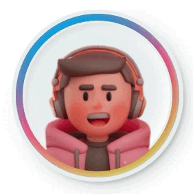

<p align="right">(<a href="README_en.md">EN</a>)</p>
<div id="top"></div>

<br />
<div align="center">
  <a href="https://github.com/wladradchenko/voiceai.wladradchenko.ru">
    
  </a>

  <h3 align="center">Voice AI</h3>

  <p align="center">
    Документация о проекте
    <br/>
    <br/>
    <br/>
    <a href="https://github.com/wladradchenko/voiceai.wladradchenko.ru/issues">Сообщить об ошибке</a>
    ·
    <a href="https://github.com/wladradchenko/voiceai.wladradchenko.ru/issues">Запросить функцию</a>
  </p>
</div>


<!-- ABOUT THE PROJECT -->
## О проекте

Приложение для синтеза речи из текста и распознования речи в текст. Одной из уникальных особенностей этого приложения является возможность создавать мультидиалоги с несколькими голосами, а количество используемых символов не ограничено, в отличие от аналогичных веб-приложений. Вы также можете проговаривать текст в режиме реального времени, и приложение распознает его по аудио. Эта функция отлично подходит для диктовки текста вместо того, чтобы набирать его вручную.

В целом, это настольное приложение с нейронными сетями представляет собой удобный и мощный инструмент для всех, кто нуждается в синтезе речи и распознавании голоса в текст. Лучше всего то, что приложение бесплатно, устанавливается локально и проста в использовании! А применить вы его можете, в озвучке роликов, книг, игр, итд.

<!-- FEATURES -->
## Запуск

Требуется 3.8 <= Python <=3.10.

Установить зависимости:

```
pip install -r requirements.txt
```

Скачать модели нейронных сетей, конфигурации и словарь:
```
wget invest.wladradchenko.ru/static/voiceai.wladradchenko.ru/download/voiceai.robot.zip 
mv DOWNLOAD_DIR/voiceai.robot.zip voiceai.wladradchenko.ru/portable/src/backend/voiceai.robot.zip
cd voiceai.wladradchenko.ru/portable/src/backend/
unzip voiceai.robot.zip
```

Распаковать архив:
```
Папка data в voiceai.wladradchenko.ru/portable/src/backend
Файл конфигураций config.yaml в voiceai.wladradchenko.ru/portable/src/backend/config.yaml
Словарь stress.dict в voiceai.wladradchenko.ru/portable/src/backend/tps/data
```

Добавить модели для создания анимации. Переходим в директорию talker

```
cd voiceai.wladradchenko.ru/talker
```

Создать директорию checkpoints и скачать файлы через скрипт scripts/download_models.sh:

```
bash scripts/download_models.sh
```

Для Windows, файлы можно установить по [ссылке](https://drive.google.com/drive/folders/1Wd88VDoLhVzYsQ30_qDVluQr_Xm46yHT?usp=sharing).

В папке checkpoints будет два архива: BFM_Fitting.zip и hub.zip - их нужно распаковать. 

При первом запуске модуля синтеза видео скачаются файлы для gfpgan.

Запустить:
```
briefcase dev
```

Дополнительно, вы можете создать build
```
briefcase build
```

Запуск build
```
briefcase run
```

Для создания установщика:
```
briefcase package
```

Подробнее в документации [BeeWare](https://beeware.org/project/projects/tools/briefcase)

<!-- DOWNLOAD -->
## Готовые сборки
Ubuntu / Debian - [https://wladradchenko.ru/voice](https://invest.wladradchenko.ru/static/voiceai.wladradchenko.ru/download/linux/voiceai_1.0.0-1~ubuntu-jammy_amd64.deb)

```
// Установка приложения
sudo dpkg -i voiceai.deb

// Удаление приложения
sudo dpkg -r voiceai

// Для создания видео не под sudo
sudo chmod -R a+rwx /usr/lib/voiceai/app/talker/gfpgan/weights
sudo chmod -R a+rwx /usr/lib/voiceai/app/talker/checkpoints

// Удаление кеша
rm -rf ~/.voiceai
```


<!-- VIDEO -->
## Видео

[](https://youtu.be/oHQR1Zx6YOk)

<!-- CONTACT -->
## Контакт

Автор: [Wladislav Radchenko](https://github.com/wladradchenko/)

Почта: [i@wladradchenko.ru](i@wladradchenko.ru)

Проект: [https://github.com/wladradchenko/voiceai.wladradchenko.ru](https://github.com/wladradchenko/voiceai.wladradchenko.ru)

Сайт приложения: [wladradchenko.ru/voice](https://wladradchenko.ru/voice)

<!-- CREDITS -->
## Зависимости

* Tacatron 2 - https://github.com/NVIDIA/tacotron2
* Waveglow - https://github.com/NVIDIA/waveglow
* Flask UI - https://github.com/ClimenteA/flaskwebgui
* BeeWare - https://beeware.org/project/projects/tools/briefcase/
* Sad Talker - https://github.com/OpenTalker/SadTalke
* Face Utils: https://github.com/xinntao/facexlib
* Face Enhancement: https://github.com/TencentARC/GFPGAN
* Image/Video Enhancement:https://github.com/xinntao/Real-ESRGAN


<p align="right">(<a href="#top">вернуться наверх</a>)</p>
