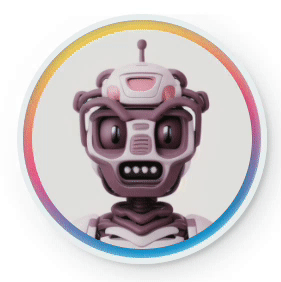

[<a href="README_ru.md">RU</a>]

 

  

  <h3 align="center">Wunjo AI: Advanced Speech & Deepfake Neural Network Tool</h3>

  

    <a href="https://github.com/wladradchenko/wunjo.wladradchenko.ru/wiki">Documentation</a>
     
    <a href="https://github.com/wladradchenko/wunjo.wladradchenko.ru/issues">Issue</a>
    ·
    <a href="https://github.com/wladradchenko/wunjo.wladradchenko.ru/discussions">Discussions</a>
    ·
    <a href="https://youtube.com/playlist?list=PLJG0sD6007zFJyV78mkU-KW2UxbirgTGr&feature=shared">Tutorial</a>
  

<!-- ABOUT THE PROJECT -->
## About

Unlock the unparalleled capabilities of neural networks with Wunjo AI. Whether you're delving into speech synthesis, crafting deepfake animations, drawing Stable Diffusion video by text prompt or video making, Wunjo AI has got you covered.

**Key Features:**

- **Speech Synthesis:** Effortlessly convert text into human-like speech.
- **Voice Cloning:** Clone voices from provided audio files or directly record your voice within the app for real-time cloning.
- **Multilingual Support:** Currently supports English, Russian, Chinese for voice cloning (from any language audio) and English, Russian synthesis, with plans to extend voice cloning synthesis model for Spanish.
- **Real-time Speech Recognition:** Dictate text and get instant transcriptions. An efficient tool for hands-free content creation.
- **Multidialogue Creation:** Craft multi-dialogues using unlimited characters with distinct voice profiles.
- **Video-to-Video by Text Prompt:**
  - Reshape videos with by text prompt with difference models of Stable Diffusion. Let generative neural networks craft a new visual narrative.
  - Change individual objects in a video by text prompt with one click, changing them throughout the video with unique text queries.
  - Preserve specific objects without change by using the «pass» keyword.
- **Deepfake Animation:**
  - Animate faces using just one photo combined with audio.
  - Achieve precise lip syncing with your audio using our deepfake lips feature.
  - Effortlessly swap faces in videos, GIFs, and photos using just a single photograph with our "Face Swap" feature.
  - Experimental feature. Change the emotions of a person in the video, with the help of a text description.
- **AI Retouch Tool:** Elevate your videos by removing unwanted objects or refining the quality of your deepfakes.
- **Automatic Segmentation Mask:** Select any object at any time period and get a storyboard of the selected object with a transparent or colored background.

**Applications:**
From voiceovers in commercials to character voicing in games, from audiobook narrations to fun deepfake projects, Wunjo AI offers endless possibilities and all is free and local on your device.

**Why Choose Wunjo AI?:**

- **All-in-One:** A comprehensive tool catering to both your voice and visual AI needs.
- **User-friendly:** Designed for all, from beginners to professionals.
- **Privacy First:** Functions locally on your desktop, ensuring your data remains private.
- **Open-source & Free:** Benefit from community-driven enhancements and enjoy the app without any cost.

Step into the future of AI-powered creativity with Wunjo AI.

<!-- FEATURES -->
## Setup

Requirements [Python](https://www.python.org/downloads/) version 3.10 and [ffmpeg](https://ffmpeg.org/download.html).

For detailed instructions about setup Wunjo AI from GitHub, refer to the [Launch Project from GitHub](https://github.com/wladradchenko/wunjo.wladradchenko.ru/wiki/How-to-install-the-application#launch-project-from-github) section in our wiki.

<!-- DOWNLOAD -->
## Install packets

### [Ubuntu / Debian v1.6 (GPU version)](https://wladradchenko.ru/static/wunjo.wladradchenko.ru/build/linux/wunjo_1.6.0.deb)

For detailed instructions about install Wunjo AI on [Ubuntu / Debian OS](https://github.com/wladradchenko/wunjo.wladradchenko.ru/wiki/How-to-install-the-application#installation-on-ubuntu) from installer

### MacOS v1.6 (CPU version)

Due to the fact that the author of the project does not have an Apple license, there is currently no way to create an official installer.

### [Windows v1.6 (CPU version)](https://wladradchenko.ru/static/wunjo.wladradchenko.ru/build/windows/wunjo_1.6.0.msi)

For detailed instructions about install Wunjo AI on [Windows](https://github.com/wladradchenko/wunjo.wladradchenko.ru/wiki/How-to-install-the-application#installation-on-windows) from installer

Read in Wunjo AI documentation how [use GPU](https://github.com/wladradchenko/wunjo.wladradchenko.ru/wiki/How-to-use-the-GPU-in-the-application) on Windows.

<!-- EXAMPLE -->
## Example

### Speech synthesis and voice cloning

- [Russian synthesized voice from text](https://soundcloud.com/vladislav-radchenko-234338135/russian-voice-text-synthesis?si=ebfc8ea75d0f4c56a3012ca4fdfb6ab5&utm_source=clipboard&utm_medium=text&utm_campaign=social_sharing)
- [English voice cloned from previously synthesized Russian voice](https://soundcloud.com/vladislav-radchenko-234338135/english-voice-clone?si=057718ee0e714e79b2023ce2e37dfb39&utm_source=clipboard&utm_medium=text&utm_campaign=social_sharing)
- [Chinese voice cloned from a previously synthesized Russian voice](https://soundcloud.com/vladislav-radchenko-234338135/chinese-voice-clone?si=43d437bbdf4d4d9a80c7a4a0031189c0&utm_source=clipboard&utm_medium=text&utm_campaign=social_sharing)

### Face animation from image src

  <table>
  <tr>
    <th>Original</th>
    <th>Move face + Enhancer</th>
    <th>Fix face + Enhancer</th>
  </tr>
  <tr align="center">
    <td></td>
    <td></td>
    <td></td>
  </tr>
</table>

### Mouth animation from video src

  <table>
  <tr>
    <th>Original</th>
    <th>Mouth animation</th>
    <th>Mouth animation + Enhancer</th>
  </tr>
  <tr align="center">
    <td></td>
    <td></td>
    <td></td>
  </tr>
</table>

### Face swap by one photo

  <table>
  <tr>
    <th>Original photo</th>
    <th>Original video</th>
    <th>Face swap + Background enhancer</th>
  </tr>
  <tr align="center">
    <td></td>
    <td></td>
    <td></td>
  </tr>
</table>

### Remove object by Retouch AI

  <table>
  <tr>
    <th>Original video</th>
    <th>Remove object</th>
  </tr>
  <tr align="center">
    <td></td>
    <td></td>
  </tr>
</table>

### Retouch AI to improve quality of deepfake

  <table>
  <tr>
    <th>Defective lines on the chins after animation lip</th>
    <th>Retouch lines on the chins + Face swap</th>
  </tr>
  <tr align="center">
    <td></td>
    <td></td>
  </tr>
</table>

### Get segmentation mask by one click

  <table>
  <tr>
    <th>Original</th>
    <th>Mask</th>
  </tr>
  <tr align="center">
    <td></td>
    <td></td>
  </tr>
</table>

### Video-to-Video by Text Prompt (Only for GPU)

The __higher the video resolution__, __the better the quality__ of the drawn frames.

#### Video resolution 512x512 default model for deepfake

  <table>
  <tr>
    <th>Original</th>
    <th>Blonde hair + Brown jacket</th>
  </tr>
  <tr align="center">
    <td></td>
    <td></td>
  </tr>
</table>

#### Video resolution 512x512 [custom model for anime](https://civitai.com/models/7371/rev-animated?modelVersionId=19575)

Additionally, you can use your custom stable diffusion model to redraw video or objects in video with difference timeline.

  <table>
  <tr>
    <th>Original</th>
    <th>Pass object + Background change</th>
    <th>Full change</th>
  </tr>
  <tr align="center">
    <td></td>
    <td></td>
    <td></td>
  </tr>
</table>

#### Limit resolution video by GPU VRAM

  <table>
  <tr>
    <th>24 GB</th>
    <th>18 GB</th>
    <th>14 GB</th>
    <th>10 GB</th>
    <th>8 GB</th>
    <th>7 GB</th>
  </tr>
  <tr align="center">
    <th>1280x1280</th>
    <th>1024x1024</th>
    <th>768x768</th>
    <th>640x640</th>
    <th>576x576</th>
    <th>512x512</th>
  </tr>
</table>

### Emotion deepfake [Experimental]

This is an experimental feature that is under development, but you can take a look at some of the work right now in Wunjo AI.

  <table>
  <tr>
    <th>Original</th>
    <th>Happy</th>
    <th>Angry</th>
  </tr>
  <tr align="center">
    <td></td>
    <td></td>
    <td></td>
  </tr>
  <tr>
    <th>Fear</th>
    <th>Sad</th>
    <th>Disgust</th>
  </tr>
  <tr align="center">
    <td></td>
    <td></td>
    <td></td>
  </tr>
</table>

<!-- EXAMPLE -->

<!-- TRANSLATION -->
## Language

The application comes with built-in support for the following languages: English, Russian, Chinese, Portuguese, and Korean.

If you wish to add a new language:

Navigate to `.wunjo/settings/settings.json`.
Add your desired language in the format: `"default_language": {"name": "code"}`.
To find the appropriate code for your language, please refer to the [Google Cloud Translate Language Codes](https://cloud.google.com/translate/docs/languages).
<!-- TRANSLATION -->

<!-- UPDATE -->

Update 1.6.0
- [x] Improved and automated remove object from image or video
- [x] Improved edit video element
- [x] Added auto segmentation mask with save
- [x] Added Video2Video with ControlNet by text prompt tool
- [x] Added InpaintVideoMask2Video with ControlNet by text prompt tool
- [x] Optimized using memory for face swapping for long video
- [x] Optimized using memory for retouch and remove object for long video

Update 1.6.1
- [x] Fix bug with enhancer. Improve enhancer for video and face. Added enhancer for drawing video
- [x] Improved vocoder for voice cloning
- [x] Added cloning speed speech
- [x] Added model to get background sound for deepfakes and clear voice without background noise
- [x] Added feature to get background noise from audio or video 
- [x] Improved encoder for voice cloning
- [x] ~~Imitate voice [emotions](https://github.com/liuhaozhe6788/voice-cloning-collab/tree/add_emotion)~~ and improved voice cloning quality.
- [x] Reducing the amount of RAM used for mouth animation and improving video quality
- [x] Added speech enhancement
- [ ] Music generation
- [ ] Added module as Ebsynth
- [x] Multilanguage speech by one text
- [ ] Adding a new tool for creating a user-drawable mask that is attached to the segmentation object and moves with it

<!-- VIDEO -->
## Video

  <table>
  <tr>
    <th>Review</th>
    <th>How install on Windows?</th>
  </tr>
  <tr align="center">
    <td></td>
    <td></td>
  </tr>
</table>

<!-- DONAT -->
## Support the Project

You can support the author of the project in the development of his creative ideas, or just treat him to [a cup of coffee](https://www.buymeacoffee.com/wladradchenko) in USD or [a slice of pizza](https://wladradchenko.ru/donat) in RUB. There are other ways to support the development of the project, more details on [page](https://github.com/wladradchenko/wunjo.wladradchenko.ru/wiki/Support-the-Project).

  <table>
  <tr>
    <th>Buy a cup of coffee in USD</th>
    <th>Buy a slice of pizza in RUB</th>
  </tr>
  <tr align="center">
    <td></td>
    <td></td>
  </tr>
</table>

<!-- CONTACT -->
## Contact

Owner: [Wladislav Radchenko](https://github.com/wladradchenko/)

Email: [i@wladradchenko.ru](i@wladradchenko.ru)

Project: [https://github.com/wladradchenko/wunjo.wladradchenko.ru](https://github.com/wladradchenko/wunjo.wladradchenko.ru)

Web site: [wladradchenko.ru/wunjo](https://wladradchenko.ru/wunjo)

<!-- PREMISE -->
## Premise

Wunjo comes from the ancient runic alphabet and represents joy and contentment, which could tie into the idea of using the application to create engaging and expressive speech. Vunyo (ᚹ) is the eighth rune of the Elder and Anglo-Saxon Futhark. Prior to the introduction of the letter W into the Latin alphabet, the letter Ƿynn (Ƿƿ) was used instead in English, derived from this rune.

<!-- CREDITS -->
## Credits

Wunjo AI is built upon the remarkable work of various open-source projects. Each integrated component reflects a commitment to improving and adapting existing technologies within the collaborative landscape of open-source development. The list below highlights the projects that have been adapted and enhanced for inclusion in Wunjo AI:

- **Speech Synthesis & Voice Cloning:** Adapted versions of [Tacotron 2](https://github.com/NVIDIA/tacotron2), [Waveglow](https://github.com/NVIDIA/waveglow), and improved [Real-Time Voice Cloning](https://github.com/CorentinJ/Real-Time-Voice-Cloning) with [VoiceFixer](https://github.com/haoheliu/voicefixer)
- **User Interface & Packaging:** Implementations of [Flask UI](https://github.com/ClimenteA/flaskwebgui) and [BeeWare](https://beeware.org/project/projects/tools/briefcase/)
- **Audio Processing:** Adapted [Open-Unmix](https://github.com/sigsep/open-unmix-pytorch) for audio separation
- **Facial Animation & Enhancement:** Adapted versions of [Wav2lip](https://github.com/Rudrabha/Wav2Lip), [Face Utils](https://github.com/xinntao/facexlib) and enhanced [Sad Talker](https://github.com/OpenTalker/SadTalker)
- **Image & Video Enhancement:** Adapted [Real-ESRGAN](https://github.com/xinntao/Real-ESRGAN) for superior quality enhancements
- **Video Processing & Segmentation:** Adaptations of [Segment Anything](https://github.com/facebookresearch/segment-anything), [Rerender a Video](https://github.com/williamyang1991/Rerender_A_Video), [GMFlow](https://github.com/haofeixu/gmflow), [ControlNet](https://github.com/lllyasviel/ControlNet) and upgraded [Ebsynth](https://github.com/jamriska/ebsynth)
- **AI Art Generation:** Adaptation of [Stable Diffusion](https://github.com/Stability-AI/stablediffusion) for creative video AI-driven art

I extend my deepest gratitude to the original contributors of these technologies. Their groundbreaking work has been instrumental in advancing the capabilities of Wunjo AI. For the persistent storage and versioning of the models I have personally trained, I utilize the [Hugging Face Model Storage](https://huggingface.co/wladradchenko/wunjo.wladradchenko.ru). If you're interested in contributing to Wunjo AI, especially in the area of voice cloning for new languages, please feel free to propose your models or reach out for collaboration via [GitHub Discussions](https://github.com/wladradchenko/wunjo.wladradchenko.ru/discussions) or the [Hugging Face](https://huggingface.co/wladradchenko/wunjo.wladradchenko.ru/discussions).

[<a href="#top">to top</a>]

