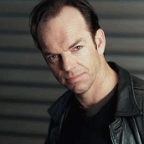
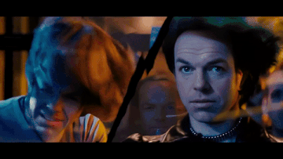
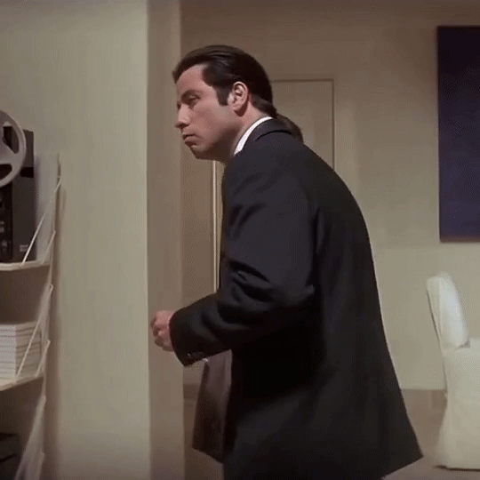
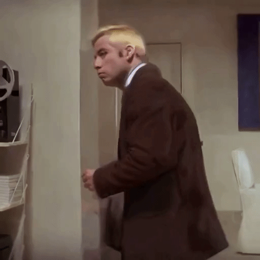
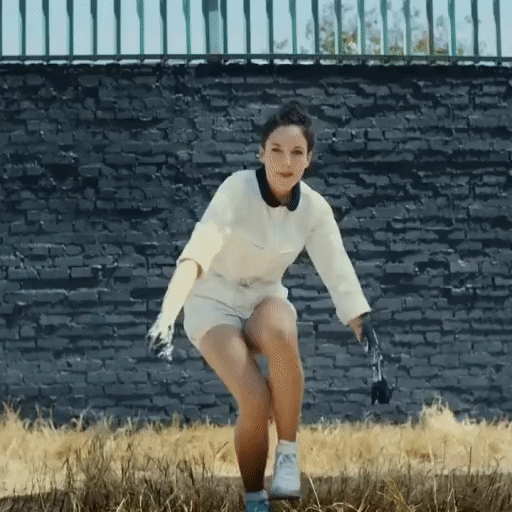

[<a href="README.md">EN</a>]

 

  

  <h3 align="center">Wunjo AI</h3>

  

    <a href="https://github.com/wladradchenko/wunjo.wladradchenko.ru/wiki">Документация о проекте</a>
     
    <a href="https://github.com/wladradchenko/wunjo.wladradchenko.ru/issues">Сообщить об ошибке</a>
    ·
    <a href="https://github.com/wladradchenko/wunjo.wladradchenko.ru/discussions">Предложить улучшения</a>
    ·
    <a href="https://youtube.com/playlist?list=PLJG0sD6007zFJyV78mkU-KW2UxbirgTGr&feature=shared">Видео курс</a>
  

<!-- ABOUT THE PROJECT -->
## О проекте

Используйте возможности нейронных сетей с помощью Wunjo AI для множества задач. Если вы углубляетесь в синтез речи, клонирование голоса, создаете дипфейк анимации, рисуете видео Stable Diffusion с помощью текстовых подсказок или создаете видео, Wunjo AI поможет вам.

**Что умеет?**

- **Синтез речи:** Легко преобразуйте текст в человеческую речь.
- **Клонирование голоса:** Клонируйте голоса из предоставленных аудиофайлов или напрямую записывайте свой голос в приложении для клонирования в реальном времени.
- **Многоязычная поддержка:** В настоящее время поддерживается английский, русский, китайский для клонирования голоса (с любого языка аудио) и синтеза речи на английском и русском языках - в ближайшее время планируется расширить приложение, добавить модель клонирования голоса на испанский язык.
- **Распознавание речи в реальном времени:** Диктуйте текст и мгновенно получайте транскрипцию. Эффективный инструмент для создания контента без помощи рук.
- **Создание мультидиалогов:** Создавайте мультидиалоги, используя персонажей с разными голосовыми профилями вы можете создавать диалоги. __Если вам не хватит голосов, вы сможете в приложении обучить модель на своем голосе.__
- **Преобразование видео в видео по текстовой подсказке:**
   - Изменяйте видео с помощью простой текстовой подсказки. Позвольте генеративным нейронным сетям создать новое визуальное повествование.
   - Изменяйте отдельные объекты в видео текстовым запросом одним щелчком мыши, изменяя их на протяжении всего видео с помощью уникальных текстовых запросов.
   - Исключайте изменение объектов, используя ключевое слово «pass».
- **Дипфейк анимация:**
   - Анимируйте лица, используя всего одну фотографию в сочетании со звуком.
   - Обеспечьте точную синхронизацию губ со звуком с помощью функции дипфейка губ.
   - С легкостью меняйте лица в видео, GIF-файлах и фотографиях, используя всего одну фотографию, с помощью функции «Замена лиц».
   - Экспериментальная функция. Измените эмоции человека на видео, при помощи текстового описания.
- **Инструмент AI Retouch:** Улучшите качество своих видео, удалив ненужные объекты или улучшив качество дипфейков.
- **Автоматичесское получение объектов:** Выделите любой объект в любой период времени и получите раскадровку выбранного объекта с прозрачным или цветным фоном.

**Приложения:**
От озвучки в рекламных роликах до озвучки персонажей в играх, от аудиокниг до забавных дипфейковых проектов или творческих видео — Wunjo AI предлагает безграничные возможности, и все это бесплатно и локально на вашем устройстве.

**Почему стоит выбрать Wunjo AI?:**

- **Все в одном:** Комплексный инструмент, отвечающий потребностям как голосового, так и визуального искусственного интеллекта.
- **Удобство использования**: Предназначено для всех, от новичков до профессионалов.
- **Конфиденциальность прежде всего:** Работает локально на вашем рабочем столе, обеспечивая конфиденциальность ваших данных.
- **Открытый исходный код и бесплатно:** Воспользуйтесь преимуществами улучшений, предложенных сообществом, и наслаждайтесь приложением без каких-либо затрат.

Шагните в будущее творчества на основе искусственного интеллекта с Wunjo AI.

<!-- FEATURES -->
## Запуск

Требуется [Python](https://www.python.org/downloads/) версии 3.10 и [ffmpeg](https://ffmpeg.org/download.html).

Подробные инструкции по установке Wunjo AI с GitHub см. в разделе [Запуск проекта с GitHub](https://github.com/wladradченко/wunjo.wladradkova.ru/wiki/How-to-install-the-application#launch- project-from-github) в нашей вики.

<!-- DOWNLOAD -->
## Готовые сборки

### [Ubuntu / Debian v1.6 (GPU version)](https://wladradchenko.ru/static/wunjo.wladradchenko.ru/build/linux/wunjo_1.6.0.deb)

Подробные инструкции по установке Wunjo AI с установщика на [Ubuntu/Debian OS](https://github.com/wladradченко/wunjo.wladradkova.ru/wiki/How-to-install-the-application#installation-on-ubuntu).

### MacOS v1.6 (CPU version)

В связи с тем, что у автора проекта нет лицензии Apple, на данный момент нет возможности создать официальный установщик.

### [Windows v1.6 (CPU version)](https://wladradchenko.ru/static/wunjo.wladradchenko.ru/build/windows/wunjo_1.6.0.msi)

Подробные инструкции по установке Wunjo AI с установщика на [Windows](https://github.com/wladradченко/wunjo.wladradkova.ru/wiki/How-to-install-the-application#installation-on-ubuntu).

<!-- EXAMPLE -->
## Пример

### Синтез речи и клонирование голоса

- [Русский синтезированный голос из текста](https://soundcloud.com/vladislav-radchenko-234338135/russian-voice-text-synthesis?si=ebfc8ea75d0f4c56a3012ca4fdfb6ab5&utm_source=clipboard&utm_medium=text&utm_campaign=social_sharing)
- [Английский голос клонированный из ранее синтезированного русского голоса](https://soundcloud.com/vladislav-radchenko-234338135/english-voice-clone?si=057718ee0e714e79b2023ce2e37dfb39&utm_source=clipboard&utm_medium=text&utm_campaign=social_sharing)
- [Китайский голос клонированный из ранее синтезированного русского голоса](https://soundcloud.com/vladislav-radchenko-234338135/chinese-voice-clone?si=43d437bbdf4d4d9a80c7a4a0031189c0&utm_source=clipboard&utm_medium=text&utm_campaign=social_sharing)

### Анимация лица из изображения

  <table>
  <tr>
    <th>Оригинал</th>
    <th>Движение лица + Улучшение лица</th>
    <th>Фиксированное лицо + Улучшение лица</th>
  </tr>
  <tr align="center">
    <td></td>
    <td></td>
    <td></td>
  </tr>
</table>

### Анимация рта из видео

  <table>
  <tr>
    <th>Оригинал</th>
    <th>Анимация рта</th>
    <th>Анимация рта + Улучшение лица</th>
  </tr>
  <tr align="center">
    <td></td>
    <td></td>
    <td></td>
  </tr>
</table>

### Замена лица по одному фото

  <table>
  <tr>
    <th>Оригинал фото</th>
    <th>Оригинал видео</th>
    <th>Замена лица + Улучшение окружения</th>
  </tr>
  <tr align="center">
    <td></td>
    <td></td>
    <td></td>
  </tr>
</table>

### Удаление объектов с видео

  <table>
  <tr>
    <th>Оригинал</th>
    <th>С удалением машины</th>
  </tr>
  <tr align="center">
    <td></td>
    <td></td>
  </tr>
</table>

### Улучшение качества дипфейка ретушью

  <table>
  <tr>
    <th>Дефектные линии на подбородке после анимации лица</th>
    <th>Ретушь подбородка + Замена лица</th>
  </tr>
  <tr align="center">
    <td></td>
    <td></td>
  </tr>
</table>

### Автоматичесское получение масок объектов

Вы можете сохранить из видео обьекты с вырезанным прозрачным или цветным фоном

  <table>
  <tr>
    <th>Оригинал</th>
    <th>Полученная маска из изображений</th>
  </tr>
  <tr align="center">
    <td></td>
    <td></td>
  </tr>
</table>

### Преобразование видео в видео по текстовой подсказке (Только на GPU)

__Большее разрешение видео__, __дает лучше качество__ для нарисованных кадров. Максимальное разрешение видео зависит от количество VRAM.

#### Разрешение результата 512x512 и используется модель для дипфейков

  <table>
  <tr>
    <th>Оригинал</th>
    <th>Блондин + Коричневый пиджак</th>
  </tr>
  <tr align="center">
    <td></td>
    <td></td>
  </tr>
</table>

#### Разрешение результата 512x512 [кастомная модель stable diffusion](https://civitai.com/models/7371/rev-animated?modelVersionId=19575)

Кроме того, вы можете использовать свою собственную модель stable diffusion для перерисовки видео или объектов в видео с разной временной шкалой.

  <table>
  <tr>
    <th>Оригинал</th>
    <th>Pass объекта + Изменение фона</th>
    <th>Изменить весь кадр</th>
  </tr>
  <tr align="center">
    <td></td>
    <td></td>
    <td></td>
  </tr>
</table>

#### Ограничения разрешения видео по VRAM графического процессора

  <table>
  <tr>
    <th>24 GB</th>
    <th>18 GB</th>
    <th>14 GB</th>
    <th>10 GB</th>
    <th>8 GB</th>
    <th>7 GB</th>
  </tr>
  <tr align="center">
    <th>1280x1280</th>
    <th>1024x1024</th>
    <th>768x768</th>
    <th>640x640</th>
    <th>576x576</th>
    <th>512x512</th>
  </tr>
</table>

### Дипфейк эмоций [Experimental]

Это экспериментальная функция, которая находится в стадии разработки, но вы можете прямо сейчас взглянуть на некоторый ее функционал в Wunjo AI.

  <table>
  <tr>
    <th>Оригинал</th>
    <th>Радость</th>
    <th>Злость</th>
  </tr>
  <tr align="center">
    <td></td>
    <td></td>
    <td></td>
  </tr>
  <tr>
    <th>Страх</th>
    <th>Грусть</th>
    <th>Отвращение</th>
  </tr>
  <tr align="center">
    <td></td>
    <td></td>
    <td></td>
  </tr>
</table>

<!-- EXAMPLE -->

<!-- TRANSLATION -->
## Языки

Приложение поставляется со встроенной поддержкой следующих языков: английский, русский, китайский, португальский и корейский.

Если вы хотите добавить новый язык:

Перейдите к `.wunjo/settings/settings.json`.
Добавьте желаемый язык в формате: `"default_language": {"name": "code"}`.
Чтобы найти соответствующий код для вашего языка, обратитесь к языковым кодам [Google Cloud Translate Language Codes](https://cloud.google.com/translate/docs/languages).
<!-- TRANSLATION -->

<!-- UPDATE -->

Обновление 1.6.0
- [x] Улучшено и автоматизировано удаление объекта из изображения или видео
- [x] Улучшен элемент редактирования видео
- [x] Добавлена автосегментации маски с сохранением
- [x] Добавлен Video2Video с ControlNet с помощью prompt.
- [x] Добавлен InpaintVideoMask2Video с ControlNet с помощью prompt.
- [x] Оптимизировано использование памяти для замены лиц для длительных видео
- [x] Оптимизировано использование памяти для ретуши и удаления объекта для длительных видео

Обновление 1.6.1
- [x] Исправлена ошибка с улучшением качества. Доработано улучшение видео и лица. Добавлено улучшение для рисованного видео.
- [x] Улучшен вокодер для клонирования голоса
- [x] Добавлено клонирования скорости говорения для клонирования речи
- [x] Добавлена модель для получения фонового звука для дипфейков и четкого голоса без фонового шума
- [x] Добавлена функция получения фонового шума из аудио или видео
- [x] Улучшен кодер для клонирования голоса
- [x] ~~Имитирование [эмоций](https://github.com/liuhaozhe6788/voice-cloning-collab/tree/add_emotion) голосом~~ и улучшено качество клонирования голоса.
- [x] Уменьшение объема RAM, используемой для анимации рта, и улучшение качества видео.
- [x] Добавлено улучшение качества речи в аудио
- [ ] Добавление отдельной панели для Ebsynth
- [ ] Генерация музыки
- [x] Многоязычная речь по одному тексту
- [ ] Добавление нового инструмента создания маски рисуемой пользователем, которая прикрепляется к объекту сегментации и двигается вместе с ним 

<!-- VIDEO -->
## Видео

  <table>
  <tr>
    <th>Обзор</th>
    <th>Как установить на Windows?</th>
  </tr>
  <tr align="center">
    <td></td>
    <td></td>
  </tr>
</table>

<!-- DONAT -->
## Поддержка

Вы можете поддержать автора проекта на развитии его креативных идей, либо просто угостить [чашкой кофе](https://wladradchenko.ru/donat). Есть и другие способы поддержать развитие проекта, подробнее на [странице](https://github.com/wladradchenko/wunjo.wladradchenko.ru/wiki/Поддержите-проект).

  <table>
  <tr>
    <th>Угостить чашкой кофе</th>
  </tr>
  <tr align="center">
    <td></td>
  </tr>
</table>

<!-- DONAT -->

<!-- CONTACT -->
## Контакт

Автор: [Wladislav Radchenko](https://github.com/wladradchenko/)

Почта: [i@wladradchenko.ru](i@wladradchenko.ru)

Проект: [https://github.com/wladradchenko/wunjo.wladradchenko.ru](https://github.com/wladradchenko/wunjo.wladradchenko.ru)

Сайт приложения: [wladradchenko.ru/wunjo](https://wladradchenko.ru/wunjo)

<!-- PREMISE -->
## Предпосылки

Wunjo (Ву́ньо) происходит из древнего рунического алфавита и представляет радость и удовлетворение, что может быть связано с идеей использования приложения для создания увлекательной и выразительной речи. Вуньо (ᚹ) — восьмая руна старшего и англосаксонского футарка. До введения буквы W в латинский алфавит вместо неё в английском языке использовалась буква Ƿynn (Ƿƿ), происходящая от этой руны.

<!-- CREDITS -->
## Зависимости

Wunjo AI создан на основе замечательных результатов различных проектов с открытым исходным кодом. Каждый интегрированный компонент отражает стремление к улучшению и адаптации существующих технологий в рамках совместной разработки с открытым исходным кодом. В списке ниже представлены проекты, которые были адаптированы и улучшены для включения в Wunjo AI:

- **Синтез речи и клонирование голоса:** Адаптированные версии [Tacotron 2](https://github.com/NVIDIA/tacotron2), [Waveglow](https://github.com/NVIDIA/waveglow) и улучшена версия [Real-Time Voice Cloning](https://github.com/CorentinJ/Real-Time-Voice-Cloning) от первоначального решения с добавлением [VoiceFixer](https://github.com/haoheliu/voicefixer)
- **Пользовательский интерфейс и упаковка:** Реализация [Flask UI](https://github.com/ClimenteA/flaskwebgui) и [BeeWare](https://beeware.org/project/projects/tools/briefcase/ )
- **Обработка звука:** Адаптированная версия [Open-Unmix](https://github.com/sigsep/open-unmix-pytorch) для разделения звука
- **Анимация и улучшение лица:** Адаптированные версии [Wav2lip](https://github.com/Rudrabha/Wav2Lip), [Face Utils](https://github.com/xinntao/facexlib) и улучшена версия [Sad Talker](https://github.com/OpenTalker/SadTalker) от первоначального решения
- **Улучшение изображений и видео:** Адаптированная версия [Real-ESRGAN](https://github.com/xinntao/Real-ESRGAN) для улучшения качества видео и изображений
- **Обработка и сегментация видео:** Адаптации [Segment Anything](https://github.com/facebookresearch/segment-anything), [Rerender a Video](https://github.com/williamyang1991/Rerender_A_Video), [GMFlow](https://github.com/haofeixu/gmflow), [ControlNet](https://github.com/lllyasviel/ControlNet) и обновленная реализация [Ebsynth](https://github.com/SingleZombie/ebsynth/tree/02ec8c4e4d4a568057363ae8b8f8bb8f7e4898c2) 
- **AI Art Generation:** Адаптация [Stable Diffusion](https://github.com/Stability-AI/stablediffusion) для изменения видео текстовыми запросами

Я выражаю благодарность первоначальным авторам этих технологий. Их новаторская работа сыграла важную роль в расширении возможностей Wunjo AI. Для постоянного хранения и управления версиями моделей, которые я лично обучил, используется [Hugging Face Model Storage](https://huggingface.co/wladradchenko/wunjo.wladradchenko.ru). Если вы заинтересованы в том, чтобы внести свой вклад в Wunjo AI, особенно в области клонирования голоса для новых языков, не стесняйтесь предлагать свои модели или обращаться к сотрудничеству через [GitHub](https://github.com/wladradchenko/wunjo.wladradchenko.ru/discussions) или [Hugging Face](https://huggingface.co/wladradchenko/wunjo.wladradchenko.ru/discussions).

[<a href="#top">вернуться наверх</a>]

